# 湖北京珠高速公路经营有限公司车辆通行稽查项目

## Hibernate Validator参数验证
- 后端对前端传过来的参数进行校验，当然某些参数在前端也会进行一次校验，后端再进行一次校验是保证参数的安全性，可能有“黑客”会绕过浏览器，直接使用 HTTP 工具，模拟请求向后端 API 接口传入违法的参数。
### Bean Validation 定义的约束注解
- 空和非空检查
  - @NotBlank ：只能用于字符串不为 null ，并且字符串 #trim() 以后 length 要大于 0 。
  - @NotEmpty ：集合对象的元素不为 0 ，即集合不为空，也可以用于字符串不为 null 。
  - @NotNull ：不能为 null 。
  - @Null ：必须为 null 。
- 数值检查
  - @DecimalMax(value) ：被注释的元素必须是一个数字，其值必须小于等于指定的最大值。
  - @DecimalMin(value) ：被注释的元素必须是一个数字，其值必须大于等于指定的最小值。
  - @Digits(integer, fraction) ：被注释的元素必须是一个数字，其值必须在可接受的范围内。
  - @Positive ：判断正数。
  - @PositiveOrZero ：判断正数或 0 。
  - @Max(value) ：该字段的值只能小于或等于该值。
  - @Min(value) ：该字段的值只能大于或等于该值。
  - @Negative ：判断负数。
  - @NegativeOrZero ：判断负数或 0 。
- Boolean 值检查
  - @AssertFalse ：被注释的元素必须为 true 。
  - @AssertTrue ：被注释的元素必须为 false 。
- 长度检查
  - @Size(max, min) ：检查该字段的 size 是否在 min 和 max 之间，可以是字符串、数组、集合、Map 等。
- 日期检查
  - @Future ：被注释的元素必须是一个将来的日期。
  - @FutureOrPresent ：判断日期是否是将来或现在日期。
  - @Past ：检查该字段的日期是在过去。
  - @PastOrPresent ：判断日期是否是过去或现在日期。
- 其它检查
  - @Email ：被注释的元素必须是电子邮箱地址。
  - @Pattern(value) ：被注释的元素必须符合指定的正则表达式。

### Hibernate Validator 附加的约束注解
- @Range(min=, max=) ：被注释的元素必须在合适的范围内。
- @Length(min=, max=) ：被注释的字符串的大小必须在指定的范围内。
- @URL(protocol=,host=,port=,regexp=,flags=) ：被注释的字符串必须是一个有效的 URL 。
- @SafeHtml ：判断提交的 HTML 是否安全。例如说，不能包含 javascript 脚本等等。
  
### @Valid 和 @Validated
- @Valid 注解，是 Bean Validation 所定义，可以添加在普通方法、构造方法、方法参数、方法返回、成员变量上，表示它们需要进行约束校验。
- @Validated 注解，是 Spring Validation 锁定义，可以添加在类、方法参数、普通方法上，表示它们需要进行约束校验。同时，@Validated 有 value 属性，支持分组校验
- **总的来说，绝大多数场景下，我们使用 @Validated 注解即可。而在有嵌套校验的场景，我们使用 @Valid 注解添加到成员属性上。**
- 有一点要注意，Bean Validation 更多做的是，无状态的参数校验。怎么理解呢？
    - 例如说，参数的大小长度等等，是适合通过 Bean Validation 中完成。
    - 例如说，校验用户名唯一等等，依赖外部数据源的，是不适合通过 Bean Validation 中完成。
  
### 实战分析
- 当在类上面使用Validated注解时，表明该Controller类的所有接口都需要进行参数校验，那么 Spring Validation 就会使用 AOP 进行切面，进行参数校验。而该切面的拦截器，使用的是 MethodValidationInterceptor 。
- **当校验的参数是平铺展开的，则不需要添加@Valid注解，直接添加参数注解，在 MethodValidationInterceptor 拦截器中，校验到参数不正确，会抛出 ConstraintViolationException 异常，返回的状态码是500。** 
- **如果校验的参数是一个包装类，这是一种嵌套校验，需要添加@Valid注解，会走 SpringMVC 的 DataBinder 机制，它会调用 DataBinder#validate(Object... validationHints) 方法，进行校验。在校验不通过时，会抛出 BindException ，返回的状态码是400。**但是在经过SpringMVC 的 DataBinder 机制之后，仍然会经过MethodValidationInterceptor 拦截器，因为整个类上都添加了@Validated注解，**因此对于参数都是POJO类时，可以不用在整个类上添加@Validated注解**
- 相比在 Controller 添加参数校验来说，在 Service 进行参数校验，会更加安全可靠。Controller 的参数校验可以不做，Service 的参数校验一定要做。
    ```java
    // UserAddDTO.java

    public class UserAddDTO {

        /**
        * 账号
        */
        @NotEmpty(message = "登录账号不能为空")
        @Length(min = 5, max = 16, message = "账号长度为 5-16 位")
        @Pattern(regexp = "^[A-Za-z0-9]+$", message = "账号格式为数字以及字母")
        private String username;
        /**
        * 密码
        */
        @NotEmpty(message = "密码不能为空")
        @Length(min = 4, max = 16, message = "密码长度为 4-16 位")
        private String password;
        
        // ... 省略 setting/getting 方法
    }
    // UserController.java

    @RestController
    @RequestMapping("/users")
    @Validated
    public class UserController {

        private Logger logger = LoggerFactory.getLogger(getClass());

        @GetMapping("/get")
        public void get(@RequestParam("id") @Min(value = 1L, message = "编号必须大于 0") Integer id) {
            logger.info("[get][id: {}]", id);
        }

        @PostMapping("/add")
        public void add(@Valid UserAddDTO addDTO) {
            logger.info("[add][addDTO: {}]", addDTO);
        }

    }
    // UserService.java

    @Service
    @Validated
    public class UserService {

        private Logger logger = LoggerFactory.getLogger(getClass());

        public void get(@Min(value = 1L, message = "编号必须大于 0") Integer id) {
            logger.info("[get][id: {}]", id);
        }

        public void add(@Valid UserAddDTO addDTO) {
            logger.info("[add][addDTO: {}]", addDTO);
        }

        public void add01(UserAddDTO addDTO) {
            this.add(addDTO);
        }

        public void add02(UserAddDTO addDTO) {
            self().add(addDTO);
        }

        private UserService self() {
            return (UserService) AopContext.currentProxy();
        }

    }
    ```


### 处理校验异常
- 如果直接将校验的结果返回给前端，提示内容的可阅读性是比较差的，所以我们需要对校验抛出的异常进行处理。使用 @ExceptionHandler 注解，实现自定义的异常处理。
- 修改 ServiceExceptionEnum 枚举类，增加校验参数不通过的错误码枚举，修改 GlobalExceptionHandler 类，增加 #constraintViolationExceptionHandler(...) 方法，处理 ConstraintViolationException 异常，修改 GlobalExceptionHandler 类，增加 #bindExceptionHandler(...) 方法，处理 BindException 异常
  ```java

    // ServiceExceptionEnum.java

    INVALID_REQUEST_PARAM_ERROR(2001001002, "请求参数不合法"),


    // GlobalExceptionHandler.java

    @ResponseBody
    @ExceptionHandler(value = ConstraintViolationException.class)
    public CommonResult constraintViolationExceptionHandler(HttpServletRequest req, ConstraintViolationException ex) {
        logger.debug("[constraintViolationExceptionHandler]", ex);
        // 拼接错误
        StringBuilder detailMessage = new StringBuilder();
        for (ConstraintViolation<?> constraintViolation : ex.getConstraintViolations()) {
            // 使用 ; 分隔多个错误
            if (detailMessage.length() > 0) {
                detailMessage.append(";");
            }
            // 拼接内容到其中
            detailMessage.append(constraintViolation.getMessage());
        }
        // 包装 CommonResult 结果
        return CommonResult.error(ServiceExceptionEnum.INVALID_REQUEST_PARAM_ERROR.getCode(),
                ServiceExceptionEnum.INVALID_REQUEST_PARAM_ERROR.getMessage() + ":" + detailMessage.toString());
    }

    // GlobalExceptionHandler.java

    @ResponseBody
    @ExceptionHandler(value = BindException.class)
    public CommonResult bindExceptionHandler(HttpServletRequest req, BindException ex) {
        logger.debug("[bindExceptionHandler]", ex);
        // 拼接错误
        StringBuilder detailMessage = new StringBuilder();
        for (ObjectError objectError : ex.getAllErrors()) {
            // 使用 ; 分隔多个错误
            if (detailMessage.length() > 0) {
                detailMessage.append(";");
            }
            // 拼接内容到其中
            detailMessage.append(objectError.getDefaultMessage());
        }
        // 包装 CommonResult 结果
        return CommonResult.error(ServiceExceptionEnum.INVALID_REQUEST_PARAM_ERROR.getCode(),
                ServiceExceptionEnum.INVALID_REQUEST_PARAM_ERROR.getMessage() + ":" + detailMessage.toString());
    }
  ```

### 自定义约束
- 有时候存在无论是 Bean Validation 定义的约束，还是 Hibernate Validator 附加的约束，都是无法满足我们复杂的业务场景，所以，我们需要自定义约束。
开发自定义约束一共只要两步：
  - 1）编写自定义约束的注解；
  - 2）编写自定义的校验器 ConstraintValidator

### 分组校验
- 在一些业务场景下，我们需要使用分组校验，即相同的 Bean 对象，根据校验分组，使用不同的校验规则。使用分组校验，核心在于添加上 @Validated 注解，并设置对应的校验分组。

### 手动校验
- 在少数业务场景下，我们可能需要手动使用 Bean Validation API ，进行参数校验。
- 步骤
  - 注入 Validator Bean 对象。
  - 创建 UserAddDTO 对象，即 「3.3 UserAddDTO」 ，已经添加相应的约束注解。
  - 调用 Validator#validate(T object, Class<?>... groups) 方法，进行参数校验。
    ```java
    // UserServiceTest.java

    @Autowired // <1.1>
    private Validator validator;

    @Test
    public void testValidator() {
        // 打印，查看 validator 的类型 // <1.2>
        System.out.println(validator);

        // 创建 UserAddDTO 对象 // <2>
        UserAddDTO addDTO = new UserAddDTO();
        // 校验 // <3>
        Set<ConstraintViolation<UserAddDTO>> result = validator.validate(addDTO);
        // 打印校验结果 // <4>
        for (ConstraintViolation<UserAddDTO> constraintViolation : result) {
            // 属性:消息
            System.out.println(constraintViolation.getPropertyPath() + ":" + constraintViolation.getMessage());
        }
    }
    ```

##  EasyExcel实现Excel的读写 导入导出操作
- 后端 前端导出实现
  - 将从数据库中查询出来的列表，转换成对应的 PostExcelVO 列表。
  - 将 GantryChargeExportVO 列表，转换成 Excel 文件，返回给前端。ExcelUtils 的 #write(...) (opens new window)方法，将列表以 Excel 响应给前端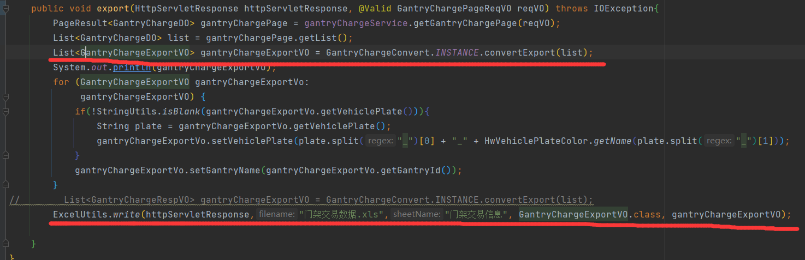
  - 构建GantryChargeExportVO类，每个字段上的 @ExcelProperty (opens new window)注解，声明 Excel Head 头部的名字，每个字段的值，就是它对应的 Excel Row 行的数据值。
  - 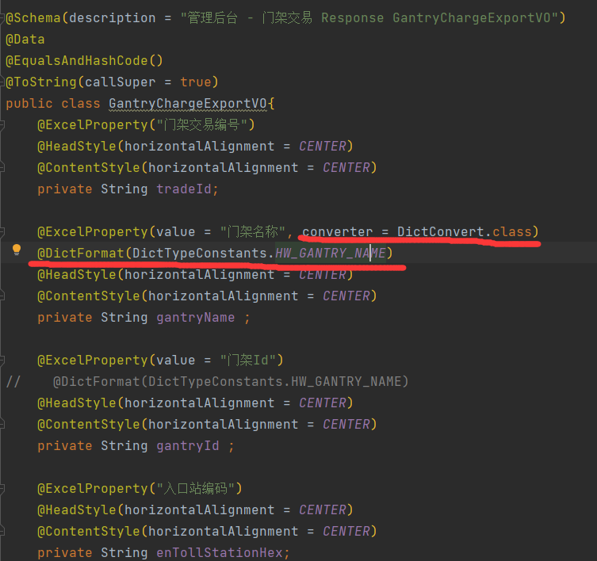 使用converter和DictFormat表明该列的数据需要进行转码， DictFormat表明对应的字典数据的类型，会构成一个枚举类来展示
  - 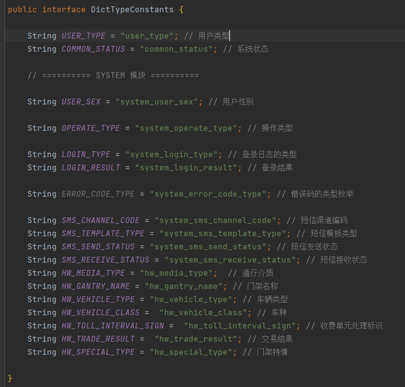


### 字段转换器
- EasyExcel 定义了 Converter (opens new window)接口，用于实现字段的转换。它有两个核心方法：
  - #convertToJavaData(...) 方法：将 Excel Row 对应表格的值，转换成 Java 内存中的值。例如说，Excel 的“状态”列，将“状态”列转换成 status = 1，”禁用”列转换成 status = 0。
  - #convertToExcelData(...) 方法：恰好相反，将 Java 内存中的值，转换成 Excel Row 对应表格的值。例如说，Excel 的“状态”列，将 status = 1 转换成“开启”列，status = 0 转换成”禁用”列
  - 我们需要完成对应的字段的转换，需要在字典数据枚举类中新增不同的字典类型，然后在字典数据中新增不同的字典类型对应的数据。
  - 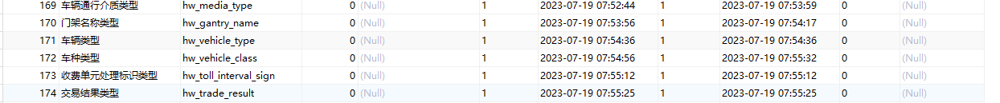 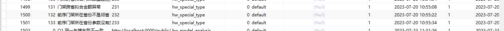 分别对应的system_dict_type 和system_dict_data表
  - 我们需要做的就是两张表中的数据、字典枚举类与导出VO进行一一对应，实现字段转换
  - 如果导出的字段数据包含其他无关的信息，可以在输出之前进行数据处理，去除掉无关信息，然后编写枚举类进行数据转换。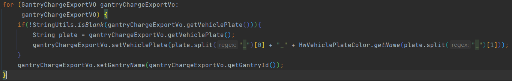
    ```java
    package cn.iocoder.yudao.framework.excel.core.convert;

    import cn.hutool.core.convert.Convert;
    import cn.iocoder.yudao.framework.dict.core.util.DictFrameworkUtils;
    import cn.iocoder.yudao.framework.excel.core.annotations.DictFormat;
    import com.alibaba.excel.converters.Converter;
    import com.alibaba.excel.enums.CellDataTypeEnum;
    import com.alibaba.excel.metadata.GlobalConfiguration;
    import com.alibaba.excel.metadata.data.ReadCellData;
    import com.alibaba.excel.metadata.data.WriteCellData;
    import com.alibaba.excel.metadata.property.ExcelContentProperty;
    import lombok.extern.slf4j.Slf4j;

    /**
    * Excel 数据字典转换器
    *
    * @author 芋道源码
    */
    @Slf4j
    public class DictConvert implements Converter<Object> {

        @Override
        public Class<?> supportJavaTypeKey() {
            throw new UnsupportedOperationException("暂不支持，也不需要");
        }

        @Override
        public CellDataTypeEnum supportExcelTypeKey() {
            throw new UnsupportedOperationException("暂不支持，也不需要");
        }

        @Override
        public Object convertToJavaData(ReadCellData readCellData, ExcelContentProperty contentProperty,
                                        GlobalConfiguration globalConfiguration) {
            // 使用字典解析
            String type = getType(contentProperty);
            String label = readCellData.getStringValue();
            String value = DictFrameworkUtils.parseDictDataValue(type, label);
            if (value == null) {
                log.error("[convertToJavaData][type({}) 解析不掉 label({})]", type, label);
                return null;
            }
            // 将 String 的 value 转换成对应的属性
            Class<?> fieldClazz = contentProperty.getField().getType();
            return Convert.convert(fieldClazz, value);
        }

        @Override
        public WriteCellData<String> convertToExcelData(Object object, ExcelContentProperty contentProperty,
                                                        GlobalConfiguration globalConfiguration) {
            // 空时，返回空
            if (object == null) {
                return new WriteCellData<>("");
            }

            // 使用字典格式化
            String type = getType(contentProperty);
            String value = String.valueOf(object);
            String label = DictFrameworkUtils.getDictDataLabel(type, value);
            if (label == null) {
                log.error("[convertToExcelData][type({}) 转换不了 label({})]", type, value);
                return new WriteCellData<>("");
            }
            // 生成 Excel 小表格
            return new WriteCellData<>(label);
        }

        private static String getType(ExcelContentProperty contentProperty) {
            return contentProperty.getField().getAnnotation(DictFormat.class).value();
        }

    }
    ```
### 后端前端的导入
- 导入时需要将file转换为对应的导入VO 导入时如果需要进行字段转换，同前面一样， 前端的导入使用elementui的el-upload进行文件上传
- 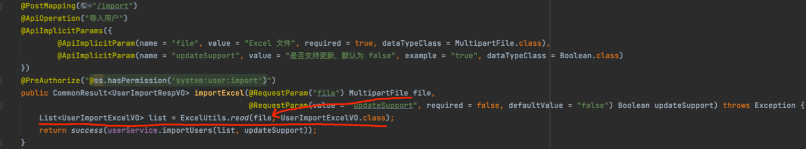
- 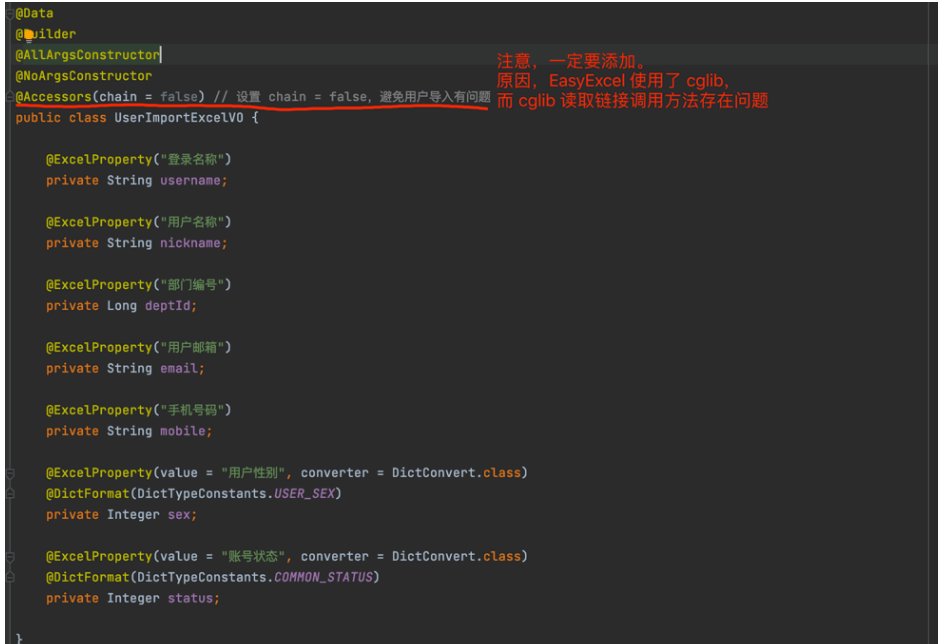


## 文件上传与下载
- 项目支持将文件上传到三类存储器：
  - 兼容 S3 协议的对象存储：支持 MinIO、腾讯云 COS、七牛云 Kodo、华为云 OBS、亚马逊 S3 等等。
  - 磁盘存储：本地、FTP 服务器、SFTP 服务器。
  - 数据库存储：MySQL、Oracle、PostgreSQL、SQL Server 等等。
- Minio文件存储 分布式文件存储系统
  - 纠删码 ：保证可靠性 通过科学计算，把丢失的数据进行还原，它可以将n份原始数据，增加m份，并能通过m+n份中的任意n份数据，还原出原始数据。如果有任意小于等于m份的数据失效，仍能通过剩下的数据还原出来。 纠错码和校验和用来保护数据免受硬件和无声数据损坏，即使丢失了一半硬盘也能完成数据恢复
  - 单机无纠删码模式： 存储的文件就是原文件  没有做数据恢复的操作 
  - 采用纠删码模式，采用多个盘进行存储
  - 分布式集群部署，将多块硬盘组成一个对象存储服务。硬盘分布在不同的节点，避免了单点故障问题 通过nginx负载均衡进行访问
- 优势
  - 数据保护
  - 高可用
  - 一致性
- java Springboot整合Minio 
  - 启动Minio 通过docker启动或者下载执行文件进行启动
  - 在图形化界面获取accessKey和secretKey 不同于登陆图形界面的账户和密码
  - 添加依赖
   ```xml
    <dependency>
        <groupId>io.minio</groupId>
        <artifactId>minio</artifactId>
        <version>8.2.1</version>
    </dependency>
   ```
   - 添加配置
   ```yml
    minio:
        # 访问的url
        endpoint: http://localhost
        # API的端口 不是图形化界面的端口
        port: 9001
        # 秘钥
        accessKey: HQGWFYLWGC6FVJ0CQFOG
        secretKey: pUGhAgQhZDxJaLmN3uz65YX7Bb3FyLdLglBvcCr1
        secure: false
        bucket-name: test # 桶名 
        image-size: 10485760 # 图片文件的最大大小
        file-size: 1073741824 # 文件的最大大小
   ```
    - 构建Minio配置
   ```java
    package com.qf.javaminio.config;

    import io.minio.MinioClient;
    import lombok.Data;
    import org.springframework.boot.context.properties.ConfigurationProperties;
    import org.springframework.context.annotation.Bean;
    import org.springframework.context.annotation.Configuration;

    @Data
    @Configuration
    @ConfigurationProperties(prefix = "minio")
    public class MinioProperties {

        /**
        * 是一个URL，域名，IPv4或者IPv6地址")
        */
        private String endpoint;

        /**
        *     //"TCP/IP端口号"
        */
        private Integer port;

        /**
        *     //"accessKey类似于用户ID，用于唯一标识你的账户"
        */
        private String accessKey;

        /**
        *     //"secretKey是你账户的密码"
        */
        private String secretKey;

        /**
        *     //"如果是true，则用的是https而不是http,默认值是true"
        */
        private boolean secure;

        /**
        *     //"默认存储桶"
        */
        private String bucketName;

        /**
        * 图片的最大大小
        */
        private long imageSize;

        /**
        * 其他文件的最大大小
        */
        private long fileSize;


        /**
        * 官网给出的 构造方法，我只是去爬了一下官网 （狗头保命）
        * 此类是 客户端进行操作的类
        */
        @Bean
        public MinioClient minioClient() {
            MinioClient minioClient =
                    MinioClient.builder()
                            .credentials(accessKey, secretKey)
                            .endpoint(endpoint,port,secure)
                            .build();
            return minioClient;
        }
    }

   ```
   - 构建Minio工具类 包括上传 下载 获取桶相关信息等方法
   ```java
    package com.qf.javaminio.utils;

    import com.qf.javaminio.config.MinioProperties;
    import io.minio.*;
    import io.minio.http.Method;
    import io.minio.messages.Bucket;
    import io.minio.messages.DeleteError;
    import io.minio.messages.DeleteObject;
    import io.minio.messages.Item;
    import lombok.RequiredArgsConstructor;
    import lombok.SneakyThrows;
    import org.springframework.stereotype.Component;
    import org.springframework.web.multipart.MultipartFile;

    import java.io.ByteArrayInputStream;
    import java.io.InputStream;
    import java.util.ArrayList;
    import java.util.LinkedList;
    import java.util.List;
    import java.util.concurrent.TimeUnit;

    @Component
    @RequiredArgsConstructor
    public class MinioUtil {

        private final MinioClient minioClient;

        private final MinioProperties minioProperties;

        /**
        * 检查存储桶是否存在
        *
        * @param bucketName 存储桶名称
        * @return
        */
        @SneakyThrows
        public boolean bucketExists(String bucketName) {
            boolean found =
                    minioClient.bucketExists(BucketExistsArgs.builder().bucket(bucketName).build());
            if (found) {
                System.out.println(bucketName + " exists");
            } else {
                System.out.println(bucketName + " does not exist");
            }
            return found;
        }

        /**
        * 创建存储桶
        *
        * @param bucketName 存储桶名称
        */
        @SneakyThrows
        public boolean makeBucket(String bucketName) {
            boolean flag = bucketExists(bucketName);
            if (!flag) {
                minioClient.makeBucket(
                        MakeBucketArgs.builder()
                                .bucket(bucketName)
                                .build());

                return true;
            } else {
                return false;
            }
        }

        /**
        * 列出所有存储桶名称
        *
        * @return
        */
        @SneakyThrows
        public List<String> listBucketNames() {
            List<Bucket> bucketList = listBuckets();
            List<String> bucketListName = new ArrayList<>();
            for (Bucket bucket : bucketList) {
                bucketListName.add(bucket.name());
            }
            return bucketListName;
        }

        /**
        * 列出所有存储桶
        *
        * @return
        */
        @SneakyThrows
        public List<Bucket> listBuckets() {
            return minioClient.listBuckets();
        }


        /**
        * 删除存储桶
        *
        * @param bucketName 存储桶名称
        * @return
        */
        @SneakyThrows
        public boolean removeBucket(String bucketName) {
            boolean flag = bucketExists(bucketName);
            if (flag) {
                Iterable<Result<Item>> myObjects = listObjects(bucketName);
                for (Result<Item> result : myObjects) {
                    Item item = result.get();
                    // 有对象文件，则删除失败
                    if (item.size() > 0) {
                        return false;
                    }
                }
                // 删除存储桶，注意，只有存储桶为空时才能删除成功。
                minioClient.removeBucket(RemoveBucketArgs.builder().bucket(bucketName).build());
                flag = bucketExists(bucketName);
                if (!flag) {
                    return true;
                }
            }
            return false;
        }

        /**
        * 列出存储桶中的所有对象名称
        *
        * @param bucketName 存储桶名称
        * @return
        */
        @SneakyThrows
        public List<String> listObjectNames(String bucketName) {
            List<String> listObjectNames = new ArrayList<>();
            boolean flag = bucketExists(bucketName);
            if (flag) {
                Iterable<Result<Item>> myObjects = listObjects(bucketName);
                for (Result<Item> result : myObjects) {
                    Item item = result.get();
                    listObjectNames.add(item.objectName());
                }
            }else{
                listObjectNames.add("存储桶不存在");
            }
            return listObjectNames;
        }


        /**
        * 列出存储桶中的所有对象
        *
        * @param bucketName 存储桶名称
        * @return
        */
        @SneakyThrows
        public Iterable<Result<Item>> listObjects(String bucketName) {
            boolean flag = bucketExists(bucketName);
            if (flag) {
                return minioClient.listObjects(
                        ListObjectsArgs.builder().bucket(bucketName).build());
            }
            return null;
        }

        /**
        * 文件上传
        *
        * @param bucketName
        * @param multipartFile
        */
        @SneakyThrows
        public void putObject(String bucketName, MultipartFile multipartFile, String filename, String fileType) {
            InputStream inputStream = new ByteArrayInputStream(multipartFile.getBytes());
            minioClient.putObject(
                    PutObjectArgs.builder().bucket(bucketName).object(filename).stream(
                            inputStream, -1, minioProperties.getFileSize())
                            .contentType(fileType)
                            .build());
        }


        /**
        * 文件访问路径
        *
        * @param bucketName 存储桶名称
        * @param objectName 存储桶里的对象名称
        * @return
        */
        @SneakyThrows
        public String getObjectUrl(String bucketName, String objectName) {
            boolean flag = bucketExists(bucketName);
            String url = "";
            if (flag) {
                url = minioClient.getPresignedObjectUrl(
                        GetPresignedObjectUrlArgs.builder()
                                .method(Method.GET)
                                .bucket(bucketName)
                                .object(objectName)
                                .expiry(2, TimeUnit.MINUTES)
                                .build());
                System.out.println(url);
            }
            return url;
        }


        /**
        * 删除一个对象
        *
        * @param bucketName 存储桶名称
        * @param objectName 存储桶里的对象名称
        */
        @SneakyThrows
        public boolean removeObject(String bucketName, String objectName) {
            boolean flag = bucketExists(bucketName);
            if (flag) {
                minioClient.removeObject(
                        RemoveObjectArgs.builder().bucket(bucketName).object(objectName).build());
                return true;
            }
            return false;
        }

        /**
        * 以流的形式获取一个文件对象
        *
        * @param bucketName 存储桶名称
        * @param objectName 存储桶里的对象名称
        * @return
        */
        @SneakyThrows
        public InputStream getObject(String bucketName, String objectName) {
            boolean flag = bucketExists(bucketName);
            if (flag) {
                StatObjectResponse statObject = statObject(bucketName, objectName);
                if (statObject != null && statObject.size() > 0) {
                    InputStream stream =
                            minioClient.getObject(
                                    GetObjectArgs.builder()
                                            .bucket(bucketName)
                                            .object(objectName)
                                            .build());
                    return stream;
                }
            }
            return null;
        }

        /**
        * 获取对象的元数据
        *
        * @param bucketName 存储桶名称
        * @param objectName 存储桶里的对象名称
        * @return
        */
        @SneakyThrows
        public StatObjectResponse statObject(String bucketName, String objectName) {
            boolean flag = bucketExists(bucketName);
            if (flag) {
                StatObjectResponse stat =
                        minioClient.statObject(
                                StatObjectArgs.builder().bucket(bucketName).object(objectName).build());
                return stat;
            }
            return null;
        }

        /**
        * 删除指定桶的多个文件对象,返回删除错误的对象列表，全部删除成功，返回空列表
        *
        * @param bucketName  存储桶名称
        * @param objectNames 含有要删除的多个object名称的迭代器对象
        * @return
        */
        @SneakyThrows
        public boolean removeObject(String bucketName, List<String> objectNames) {
            boolean flag = bucketExists(bucketName);
            if (flag) {
                List<DeleteObject> objects = new LinkedList<>();
                for (int i = 0; i < objectNames.size(); i++) {
                    objects.add(new DeleteObject(objectNames.get(i)));
                }
                Iterable<Result<DeleteError>> results =
                        minioClient.removeObjects(
                                RemoveObjectsArgs.builder().bucket(bucketName).objects(objects).build());
                for (Result<DeleteError> result : results) {
                    DeleteError error = result.get();
                    System.out.println(
                            "Error in deleting object " + error.objectName() + "; " + error.message());
                    return false;
                }
            }
            return true;
        }

        /**
        * 以流的形式获取一个文件对象（断点下载）
        *
        * @param bucketName 存储桶名称
        * @param objectName 存储桶里的对象名称
        * @param offset     起始字节的位置
        * @param length     要读取的长度 (可选，如果无值则代表读到文件结尾)
        * @return
        */
        @SneakyThrows
        public InputStream getObject(String bucketName, String objectName, long offset, Long length) {
            boolean flag = bucketExists(bucketName);
            if (flag) {
                StatObjectResponse statObject = statObject(bucketName, objectName);
                if (statObject != null && statObject.size() > 0) {
                    InputStream stream =
                            minioClient.getObject(
                                    GetObjectArgs.builder()
                                            .bucket(bucketName)
                                            .object(objectName)
                                            .offset(offset)
                                            .length(length)
                                            .build());
                    return stream;
                }
            }
            return null;
        }


        /**
        * 通过InputStream上传对象
        *
        * @param bucketName 存储桶名称
        * @param objectName 存储桶里的对象名称
        * @param inputStream     要上传的流
        * @param contentType     要上传的文件类型 MimeTypeUtils.IMAGE_JPEG_VALUE
        * @return
        */
        @SneakyThrows
        public boolean putObject(String bucketName, String objectName, InputStream inputStream,String contentType) {
            boolean flag = bucketExists(bucketName);
            if (flag) {
                minioClient.putObject(
                        PutObjectArgs.builder().bucket(bucketName).object(objectName).stream(
                                inputStream, -1, minioProperties.getFileSize())
                                .contentType(contentType)
                                .build());
                StatObjectResponse statObject = statObject(bucketName, objectName);
                if (statObject != null && statObject.size() > 0) {
                    return true;
                }
            }
            return false;
        }
    }
    ```
    - 构建判断文件类型的工具类
    ```java
    package com.qf.javaminio.utils;

    import cn.hutool.core.io.FileTypeUtil;
    import org.springframework.web.multipart.MultipartFile;

    import java.io.IOException;
    import java.io.InputStream;

    /**
    * 文件类型工具类
    */
    public class FileTypeUtils {

        private final static String IMAGE_TYPE = "image/";
        private final static String AUDIO_TYPE = "audio/";
        private final static String VIDEO_TYPE = "video/";
        private final static String APPLICATION_TYPE = "application/";
        private final static String TXT_TYPE = "text/";

        public static String getFileType(MultipartFile multipartFile) {
            InputStream inputStream = null;
            String type = null;
            try {
                inputStream = multipartFile.getInputStream();
                type = FileTypeUtil.getType(inputStream);
                System.out.println(type);
                if (type.equalsIgnoreCase("JPG") || type.equalsIgnoreCase("JPEG")
                        || type.equalsIgnoreCase("GIF") || type.equalsIgnoreCase("PNG")
                        || type.equalsIgnoreCase("BMP") || type.equalsIgnoreCase("PCX")
                        || type.equalsIgnoreCase("TGA") || type.equalsIgnoreCase("PSD")
                        || type.equalsIgnoreCase("TIFF")) {
                    return IMAGE_TYPE+type;
                }
                if (type.equalsIgnoreCase("mp3") || type.equalsIgnoreCase("OGG")
                        || type.equalsIgnoreCase("WAV") || type.equalsIgnoreCase("REAL")
                        || type.equalsIgnoreCase("APE") || type.equalsIgnoreCase("MODULE")
                        || type.equalsIgnoreCase("MIDI") || type.equalsIgnoreCase("VQF")
                        || type.equalsIgnoreCase("CD")) {
                    return AUDIO_TYPE+type;
                }
                if (type.equalsIgnoreCase("mp4") || type.equalsIgnoreCase("avi")
                        || type.equalsIgnoreCase("MPEG-1") || type.equalsIgnoreCase("RM")
                        || type.equalsIgnoreCase("ASF") || type.equalsIgnoreCase("WMV")
                        || type.equalsIgnoreCase("qlv") || type.equalsIgnoreCase("MPEG-2")
                        || type.equalsIgnoreCase("MPEG4") || type.equalsIgnoreCase("mov")
                        || type.equalsIgnoreCase("3gp")) {
                    return VIDEO_TYPE+type;
                }
                if (type.equalsIgnoreCase("doc") || type.equalsIgnoreCase("docx")
                        || type.equalsIgnoreCase("ppt") || type.equalsIgnoreCase("pptx")
                        || type.equalsIgnoreCase("xls") || type.equalsIgnoreCase("xlsx")
                        || type.equalsIgnoreCase("zip")||type.equalsIgnoreCase("jar")) {
                    return APPLICATION_TYPE+type;
                }
                if (type.equalsIgnoreCase("txt")) {
                    return TXT_TYPE+type;
                }
            } catch (IOException e) {
                e.printStackTrace();
            }
            return null;
        }
    }
    ```
    - 构建service serviceImpl Controller等类
    ```java
    package com.qf.javaminio.service.impl;

    import com.qf.javaminio.config.MinioProperties;
    import com.qf.javaminio.service.MinioService;
    import com.qf.javaminio.utils.MinioUtil;
    import io.minio.messages.Bucket;
    import lombok.RequiredArgsConstructor;
    import org.springframework.stereotype.Service;
    import org.springframework.util.StringUtils;
    import org.springframework.web.multipart.MultipartFile;

    import java.io.InputStream;
    import java.util.List;
    import java.util.UUID;

    @Service
    @RequiredArgsConstructor
    public class MinioServiceImpl implements MinioService {

        private final MinioUtil minioUtil;

        private final MinioProperties minioProperties;

        @Override
        public boolean bucketExists(String bucketName) {
            return minioUtil.bucketExists(bucketName);
        }


        @Override
        public void makeBucket(String bucketName) {
            minioUtil.makeBucket(bucketName);
        }

        @Override
        public List<String> listBucketName() {
            return minioUtil.listBucketNames();
        }

        @Override
        public List<Bucket> listBuckets() {
            return minioUtil.listBuckets();
        }

        @Override
        public boolean removeBucket(String bucketName) {
            return minioUtil.removeBucket(bucketName);
        }


        @Override
        public List<String> listObjectNames(String bucketName) {
            return minioUtil.listObjectNames(bucketName);
        }


        @Override
        public String putObject(MultipartFile file, String bucketName, String fileType) {
            try {
                // StringUtils.hasLength(bucketName) 判断传入的字串是否有内容
                bucketName = StringUtils.hasLength(bucketName) ? bucketName : minioProperties.getBucketName();
                if (!this.bucketExists(bucketName)) {
                    this.makeBucket(bucketName);
                }
                String fileName = file.getOriginalFilename();

                String objectName = UUID.randomUUID().toString().replaceAll("-", "")
                        + fileName.substring(fileName.lastIndexOf("."));
                minioUtil.putObject(bucketName, file, objectName,fileType);
                return minioProperties.getEndpoint()+":"+minioProperties.getPort()+"/"+bucketName+"/"+objectName;
            } catch (Exception e) {
                e.printStackTrace();
                return "上传失败";
            }
        }

        @Override
        public InputStream downloadObject(String bucketName, String objectName) {
            return minioUtil.getObject(bucketName,objectName);
        }

        @Override
        public boolean removeObject(String bucketName, String objectName) {
            return minioUtil.removeObject(bucketName, objectName);
        }

        @Override
        public boolean removeListObject(String bucketName, List<String> objectNameList) {
            return minioUtil.removeObject(bucketName,objectNameList);
        }

        @Override
        public String getObjectUrl(String bucketName,String objectName) {
            return minioUtil.getObjectUrl(bucketName, objectName);
        }
    }

    // Controller类的文件上传方法
    @RequestMapping("/minio")
    @RestController
    public class MinioController {

        @Autowired
        private  MinioService minioService;

        @PostMapping("/upload")
        public String uploadFile(MultipartFile file, String bucketName) {
            String fileType = FileTypeUtils.getFileType(file);
            if (fileType != null) {
                return minioService.putObject(file, bucketName, fileType);
            }
            return "不支持的文件格式。请确认格式,重新上传！！！";
        }
    }
- 文件上传相关问题     <i><https://yunyanchengyu.blog.csdn.net/article/details/123522111/>
  - 分片、并发: 分片与并发结合，将一个大文件分割成多块，并发上传，极大地提高大文件的上传速度。当网络问题导致传输错误时，只需要重传出错分片，而不是整个文件。另外分片传输能够更加实时的跟踪上传进度。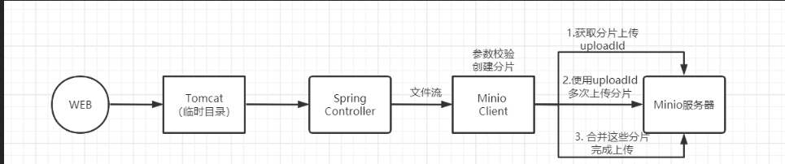  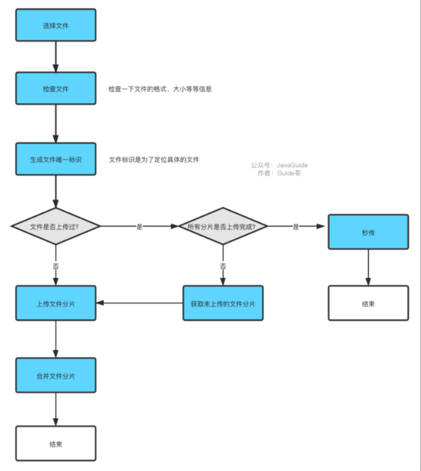
  - 分片上传优化
    - Minio 的上传接口源码，其是进行了分块，再上传分块到Minio 服务器，最后再对块进行合并。
    - 针对大文件的上传，如果采用上传到文件服务，再上传到Minio，其效率是非常低的，首先上传到文件服务（会存放在Tomcat 临时目录）就已经比较慢了。
    - 优化： 前端服务进行大文件分片处理，将分片信息传递给文件服务，文件服务返回所有分片的上传链接及该文件所有分片的唯一的uploadId;前端服务直接请求Minio 服务器，并发上传分片;所有分片上传完成后，使用uploadId 调用文件服务进行文件合并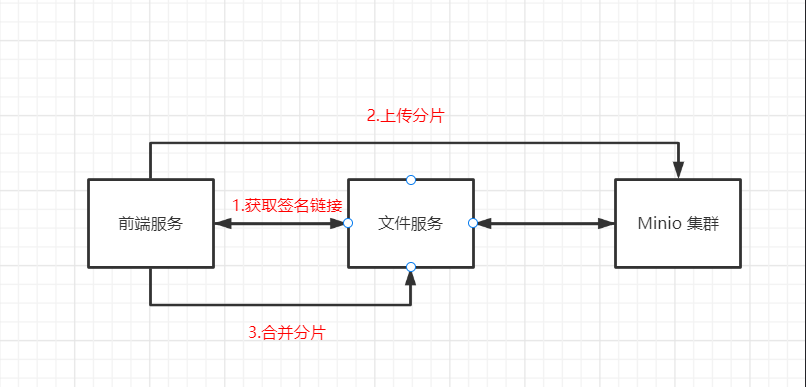
  - 预览、压缩: 常用图片格式jpg,jpeg,gif,bmp,png预览与压缩，节省网络数据传输.解析jpeg中的meta信息，对于各种orientation做了正确的处理，同时压缩后上传保留图片的所有原始meta数据。
  - Md5秒传
    - 摘要算法是一种能产生特殊输出格式的算法，这种算法的特点是：无论用户输入什么长度的原始数据，经过计算后输出的密文都是固定长度的，这种算法的原理是根据一定的运算规则对原数据进行某种形式的提取，但该算法是不可逆的，并且对原数据修改一个字符对于加密后的值都有很大的变动。
    - 在实际文件上传应用场景中，**当文件体积大、量比较多时，可以对上传前做文件md5值验证，查看该文件是否已上传过**，如果已上传，则直接显示上传成功，返回之前文件的访问链接，如果未上传过，则再执行上传。
    - **通过在前台实现对上传的文件做MD5算法验证，然后单独写一个校验接口，如果MD5算法的结果已经存在，说明后端已经存在上传的文件，放弃上传，否则继续上传。**
  - 断点续传  断点下载
    - **通过断点续传上传的方式将文件上传到OSS前，您可以指定断点记录点**。上传过程中，如果出现网络异常或程序崩溃导致文件上传失败时，将从断点记录处继续上传未上传完成的部分。**要实现断点续传，需要依赖于MD5秒传和分片上传。**
    - 文件状态查询
      - 首先上传文件之前，除了创建分片请求之外、获取uploadId之外，还需要在根据文件的MD5去查询该数据的状态，比如是已上传过、上传了一部分、上传完成、上传失败等。如果该文件已上传过则直接返回访问链接。
    - 查询已上传分片信息
      - 如果是上传失败，则查询根据该文件uploadId 查询已上传的分片信息
    - 对于已上传的分片，获取链接时，直接返回该分片已上传，前端根据状态去判断跳过该分片上传，执行未上传分片的请求，这样就能做到断点续传了。
  - 断点续传下载将需要下载的文件分成若干个分片分别下载，所有分片都下载完成后，将所有分片合并成完整的文件。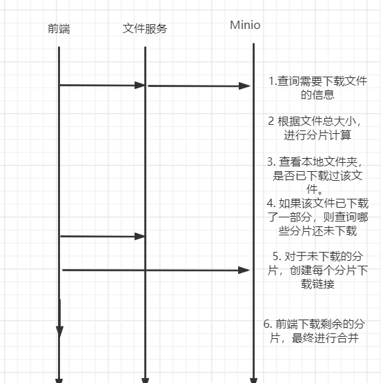


##  SpringSecurity进行系统的认证与授权

## ShardingSphere对车辆通行数据进行分库分表, 索引构建与优化
- 分库分表
  - 因为高速公路车辆数据量过大，单库无法支撑，需要进行分库分表。我们根据车辆通行时间的数据划分每一年的数据为一个库，每一年的数据为划分出多张表，包括门架通行数据表（车辆通行被门架记录的信息），收费站入站、出站数据表和车辆牌识数据表（也就是车辆通行的拍照信息。我们按照月份信息将一年的数据表分成多张表，这样就实现了分库分表。
  - 标准分片策略 只支持对单个分片键的分库分表，SQL 语句中有>，>=, <=，<，=，IN 和 BETWEEN AND 操作符，都可以应用此分片策略。
    - PreciseShardingAlgorithm（精准分片）
      - 
    - RangeShardingAlgorithm（范围分片）
      - 
  - 复合分片策略
  - 行表达式分片策略
  - Hint分片策略

## 使用Pyqt+Scrapy进行前期数据的多线程采集与导入

## 使用Redis实现登录消息缓存

## 使用RabbitMq实现消息队列功能，如缓存数据刷新，异步任务等

## 稽查系统车辆稽查方案的多种模型的构建

## Docker构建容器，部署前后端系统   nginx进行反向代理和负载均衡
### nginx反向代理和负载均衡
  - 代理问题：客户端到底要将请求发送给哪台服务器 
    - 正向代理 ： 正向代理服务是由客户端设立的。客户端了解代理服务器和目标服务器都是谁。帮助咱们实现突破访问权限，提高访问的速度，对目标服务器隐藏客户端的ip地址。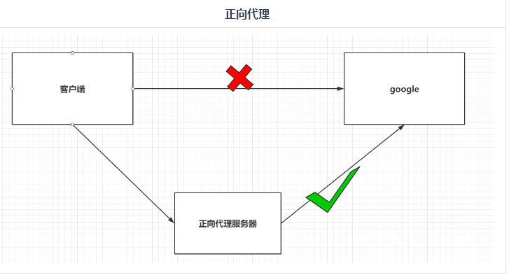
    - 反向代理： 反向代理服务器是配置在服务端的。客户端是不知道访问的到底是哪一台服务器。达到负载均衡，并且可以隐藏服务器真正的ip地址。
    ```conf
    server {    # server 块是http 块中的 内容
        listen       80;    # nginx 默认监听的端口号
        listen  [::]:80;
        server_name  localhost;  # ip

        location / {
            #root /usr/share/nginx/html;
            #index index.html index.htm;
            proxy_pass http://192.168.174.128:8080;
        }

        #50x 错误页面跳转
        error_page   500 502 503 504  /50x.html;
        location = /50x.html {
            root   /usr/share/nginx/html;
        }

    }
    ```
  - 负载均衡问题： 决定客户端的请求能分配到不同的服务器上 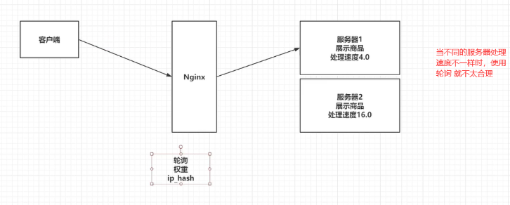
    - 轮询：将客户端发起的请求，平均的分配给每一台服务器。 默认策略
   ```conf
        #########      轮询访问   一次80   一次81
        #负载均衡
        upstream ssm {
        server 192.168.29.110:8080;
        server 192.168.29.110:8081;
        }

        server {
            listen       80;
            server_name  localhost;


            #  演示  负载均衡
            location / {
                proxy_pass http://ssm;
            }
        }
   ```
    - 权重：会将客户端的请求，根据服务器的权重值不同，分配不同的数量。
   ```conf
    upstream emp {
        server 192.168.174.128:8080 weight=2;
        server 192.168.174.128:8081 weight=1;
    }

    server {    # server 块是http 块中的 内容
        listen       80;    # nginx 默认监听的端口号
        listen  [::]:80;
        server_name  localhost;  # ip

        location / {
            proxy_pass http://emp;
        }

        #50x 错误页面跳转
        error_page   500 502 503 504  /50x.html;
        location = /50x.html {
            root   /usr/share/nginx/html;
        }

    }
   ```
    - ip_hash：基于发起请求的客户端的ip地址不同，他始终会将请求发送到指定的服务器上。 根据ip地址计算出一个结果, 根据这个结果找对应的服务器
  ```
    upstream emp {
        ip_hash;
        server 192.168.174.128:8080;
        server 192.168.174.128:8081;
    }

    server {    # server 块是http 块中的 内容
        listen       80;    # nginx 默认监听的端口号
        listen  [::]:80;
        server_name  localhost;  # ip

        location / {
            proxy_pass http://emp;
        }

        #50x 错误页面跳转
        error_page   500 502 503 504  /50x.html;
        location = /50x.html {
            root   /usr/share/nginx/html;
        }

    }
   ```
  - 资源优化问题: 客户端发送的请求可能是申请动态资源的，也有申请静态资源，但是都是去Tomcat中获取的
    - nginx动静分离 Nginx的并发能力公式：worker_processes * worker_connections / 4 | 2 = Nginx最终的并发能力，动态资源需要/4，静态资源需要/2，Nginx通过动静分离，来提升Nginx的并发能力，更快的给用户响应。
    - 动态资源代理
      - 使用proxy_pass动态代理
    - 静态资源代理
      - 通过location 指定了特性类型的静态资源访问这个路径。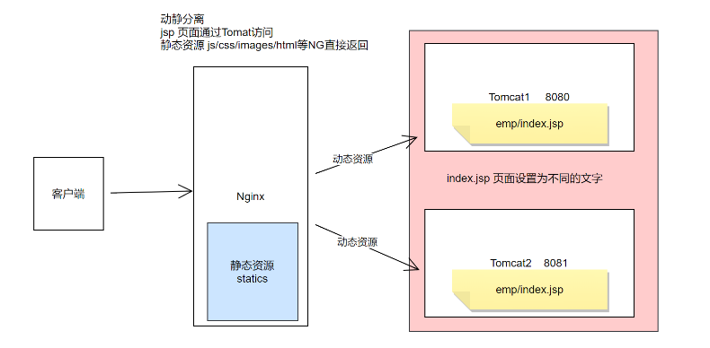

### Docker容器
- 基本的docker命令
    ```sh
        # 拉取镜像
        docker pull 镜像名称[:tag]
        # 查看本地全部镜像
        docker images
        # 删除本地镜像
        docker rmi 镜像的标识
        # 运行容器 # 常用的参数
        # -d：代表后台运行容器
        # -p 宿主机端口:容器端口：为了映射当前Linux的端口和容器的端口
        # --name 容器名称：指定容器的名称
        docker run 镜像的标识|镜像名称[:tag]     
        docker run -d -p 宿主机端口:容器端口 --name 容器名称 镜像的标识|镜像名称[:tag]   
        # 查看正在运行的容器
        # -a：查看全部的容器，包括没有运行
        # -q：只查看容器的标识
        docker ps [-qa]
        # 查看容器日志
        docker logs -f 容器id
        # 进入容器内部
        docker exec -it 容器id bash
        # 复制内容到容器
        docker cp 文件名称 容器id:容器内部路径
        # 复制容器内容到宿主机
        docker cp 容器id：容器目录    宿主机目录
        # 重启 停止 启动 删除容器  start stop restart rm 
        # 提交运行时容器为镜像
        docker commit -a='作者' -m='备注' 运行时容器ID 新镜像名称
        # 查看容器元信息
        docker inspect 容器id
        # 设置容器自启动
        docker update --restart-always 容器id
    ```
- Docker数据卷
  - 实现宿主机和容器内部文件的映射。
  - 通过数据卷名称映射，如果数据卷不存在，docker会自动创建，会将容器内部自带的文件，存储在默认的存放路径中
  - 通过路径映射数据卷，直接指定一个路径作为数据卷的存放位置。
- Dockerfile构建新的镜像
  - 由一系列命令和参数构成的脚本，这些命令应用于操作系统(centos或者Ubuntu)基础镜像并最终创建的一个新镜像；
  ```dockerfile
    from: 指定当前自定义镜像依赖的环境  指定基础镜像 一切从这里开始构建
    copy: 将相对路径下的内容复制到自定义镜像中
    workdir: 声明镜像的默认工作目录
    run: 执行的命令，可以编写多个
    cmd: 需要执行的命令（在workdir下执行的，cmd可以写多个，只以最后一个为准）

    # 举个例子，制作SSM容器镜像，而且ROOT.war要放在Dockerfile的同级目录下
    from daocloud.io/library/tomcat:9.0.0.M22
    copy ROOT.war /usr/local/tomcat/webapps
  ```
  - 执行 docker build -t 镜像名称[:tag] . 来制作镜像
- Docker-Compose 来进行镜像的批量管理 需要编写docker-compose.yml文件
  - Docker-Compose 一般与Dockerfile配合使用，在自定义镜像的同时启动当前镜像，然后由Docker-Compose进行管理。
  - 相关命令
    ```sh
        # 1. 基于docker-compose.yml启动管理的容器
        docker-compose up -d
        # 2. 关闭并删除容器
        docker-compose down
        # 3. 开启|关闭|重启已经存在的由docker-compose维护的容器
        docker-compose start|stop|restart
        # 4. 查看由docker-compose管理的容器
        docker-compose ps
        # 5. 查看日志
        docker-compose logs -f

        # 可以直接启动基于docker-compose.yml以及Dockerfile文件构建的自定义镜像
        docker-compose up -d
        # 如果自定义镜像不存在，会帮助我们构建出自定义镜像，如果自定义镜像已经存在，会直接运行这个自定义镜像
        # 重新构建的话。
        # 重新构建自定义镜像
        docker-compose build
        # 运行当前内容，并重新构建
        docker-compose up -d --build
    ```
- 部署参考
  - 前端部署 nginx 首先vue项目打包出dist文件夹，编写nginx.conf文件，然后编写Dockerfile文件
    ```Dockerfile
        # 设置基础镜像，这里使用最新的nginx镜像，前面已经拉取过了
        FROM nginx:latest
        # 定义作者 whut
        MAINTAINER whut
        # 将dist文件中的内容复制到 /usr/share/nginx/html/ 这个目录下面
        # COPY dist/  /usr/share/nginx/html/
        RUN cp /usr/share/zoneinfo/Asia/Shanghai /etc/localtime && \
            echo "Asia/Shanghai" > /etc/timezone
        # 移除nginx容器的default.conf文件、nginx配置文件
        RUN rm  /etc/nginx/conf.d/default.conf
        RUN rm  /etc/nginx/nginx.conf
        # 把主机的nginx.conf文件复制到nginx容器的/etc/nginx文件夹下
        ADD ./docker_vue/nginx.conf /etc/nginx/
        #暴露9013端口意味着前端的访问端口是9013端口，需要通过该端口进行访问，在docker-compose中也要进行9013端口映射到宿主机的端口。
        #同时需修改nginx.conf文件进行端口设置。
        # 容器间暴露9013端口.如果是云服务器部署，记得在安全组添加开放端口9013。也可以在docker run -p指定具体的，或者-P默认expose暴露的端口
        EXPOSE 9013
        # CMD命令用于容器启动时执行，而不像RUN的镜像构建时候运行
        # 使用daemon off的方式将nginx运行在前台保证镜像不退出
        CMD ["nginx", "-g", "daemon off;"]
    ```
    - redis部署 编写reids.conf文件 并编写Dockerfile文件
    ```Dockerfile
        FROM   redis:7.0.8-alpine
        WORKDIR /app/redis/
        MAINTAINER whut
        RUN rm -rf /etc/redis/redis.conf
        RUN mkdir -p   /var/log/redis/
        RUN touch   /var/log/redis/redis-server.log
        RUN chmod -R 777 /var/log/redis/
        RUN chmod 777 /var/log/redis/redis-server.log
        COPY ./docker_redis/redis.conf .
        EXPOSE  6379
        CMD ["/usr/local/bin/redis-server", "/app/redis/redis.conf"]
    ```
    - 后端部署 直接编写dockerfile文件  该文件首先创建的镜像存在一定的问题，需要二次构建修复整合再打包 需要注意的是docker里面想读取nvidia显卡，要利用GPU的增强功能   <i><https://blog.csdn.net/BigData_Mining/article/details/104991349>
    ```Dockerfile
        #从pytorch1.9的基础镜像进行构建
        FROM pytorch/pytorch:1.9.1-cuda11.1-cudnn8-devel
        MAINTAINER whut
        RUN mkdir -p /video_recognition_admin/Flask_admin/
        WORKDIR /video_recognition_admin/Flask_admin/
        COPY ./Flask_admin/ .
        COPY ./requirements.txt .
        RUN chmod  -R 777 /video_recognition_admin/Flask_admin
        RUN /bin/bash -c  'rm /etc/apt/sources.list.d/cuda.list && \
            apt-get -y update && \
            apt-get -y upgrade && \
            apt-get install -y ffmpeg  && \
            apt-get install -y supervisor && \
            mkdir -p /var/log/supervisor && \
            pip install -i https://pypi.tuna.tsinghua.edu.cn/simple --trusted-host pypi.tuna.tsinghua.edu.cn -r requirements.txt &&\
            cd /video_recognition_admin/Flask_admin/src/actionformer/libs/utils &&\
            python setup.py install --user '
        COPY ./supervisor/ ./etc/supervisor/
        EXPOSE 9000
        ENTRYPOINT ["/usr/bin/supervisord", "-n", "-c", "/etc/supervisor/supervisord.conf"] 
        #CMD ["python", "--preload", "gunicorn.py","manager:app"]
    ```
    - 编写docker-compose.yml文件
    ```yml
    version: "1.0"
    services:
            redis:
                hostname:   redis
                container_name: redis    # 不指定则会系统自动分配名称,根据BackServer/Config/config.py配置
                restart: always  # always表容器运行发生错误时一直重启
                image: redis:latest
                # build:
                # context:    ./
                # dockerfile: ./docker_redis/Dockerfile   #--port 6379 --appendonly yes --requirepass 5201020116
                #command: /usr/local/bin/redis-server /usr/local/etc/redis.conf
                # environment:    # environment 一定要在command下面
                # - TZ=Asia/Shanghai
                    # volumes:
                    #   - /etc/localtime:/etc/localtime:ro  # 设置容器时区与宿主机保持一致
                    #    - ./docker_redis/etc/:/usr/local/etc/
                privileged: true
                ports:
                    - "9379:6379"
                tty: true


            pytorch_flask:
                hostname:   pytorch_flask
                container_name: pytorch_flask
                restart:    always
                build:  .   # 执行当前的目录下的dockerfile
                    # context:    ./
                    # dockerfile: ./docker/uwsgi_flask/Dockerfile
                volumes:
                    - /etc/localtime:/etc/localtime:ro  # 设置容器时区与宿主机保持一致
                    - ./data:/video_recognition_admin/data
                    - /mnt/sda2/Pre-trained_Models:/video_recognition_admin/Pre-trained_Models
                    - ./Flask_admin:/video_recognition_admin/Flask_admin
                    - ./supervisor:/etc/supervisor
                    - ./supervisor_logs:/video_recognition_admin/supervisor_logs
                ports:
                    - "9000:9000"
                links:
                    - redis
                depends_on:
                    - redis
                tty: true


            # celery:
            #     hostname: celery
            #     container_name: celery
            #     user: nobody
            #     restart: always
            #     build:
            #     context: ./
            #     dockerfile: ./docker_celery/Dockerfile
            #     command:

            #     volumes:
            #     - /etc/localtime:/etc/localtime:ro
            #     - ./Flask_admin/apps/information:/Flask_admin/apps/information
            #     links:
            #     - redis
            #     depends_on:
            #     - redis
            #     tty: true

            nginx:
                hostname:   nginx
                container_name: nginx
                restart:    always
                build:
                    context:    ./
                    dockerfile: ./docker_vue/Dockerfile
                ports:
                    - "9013:9013"   # 根据nginx.conf配置
                volumes:
                    - ./docker_vue/dist:/usr/share/nginx/html/dist
                links:
                    - pytorch_flask
                depends_on:
                    - pytorch_flask
                tty: true

    ```
